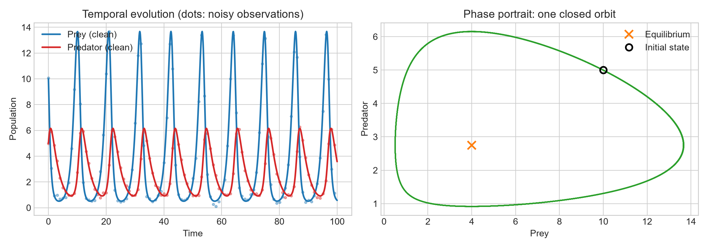
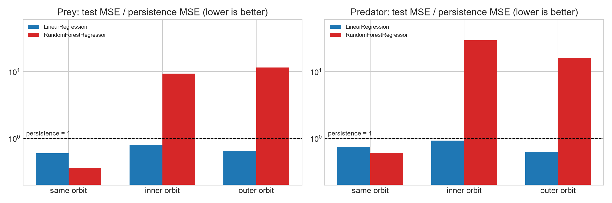
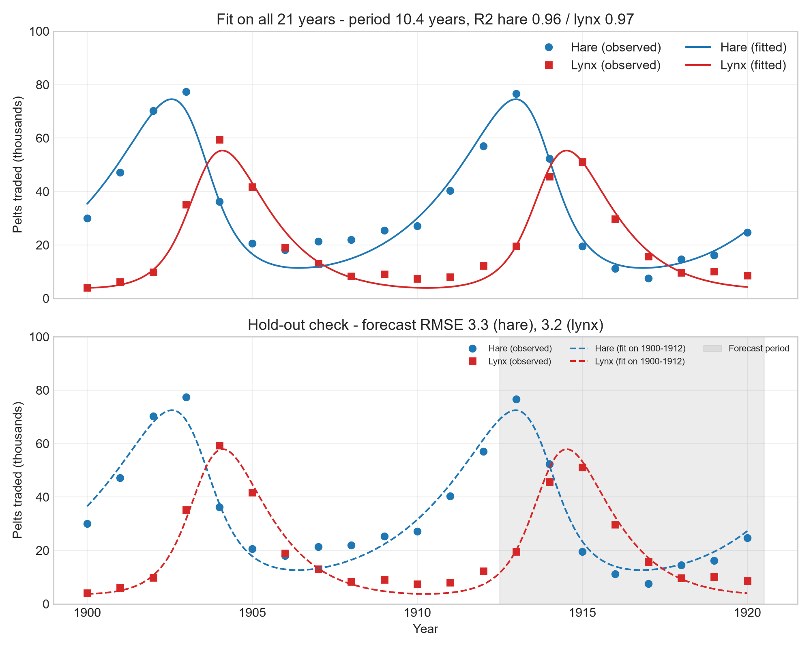

# Lotka-Volterra AI Simulator

  [](https://lotka-volterra-ai-simulator.streamlit.app/)

Predator-prey population dynamics with the Lotka-Volterra equations: numerical integration checked against the model's conserved quantity, one-step-ahead machine-learning prediction evaluated against a persistence baseline **and on orbits unseen during training**, and a fit to the Hudson Bay lynx-hare series validated on held-out years.

Author: Kokouvi Ferdinand DJATA - GitHub: [@ferdioaivision](https://github.com/ferdioaivision) (Ferdio AI Vision). Tested with Python 3.12.

---

## 1. Mathematical model

```
dx/dt = alpha * x - beta * x * y        x: prey,      alpha: prey growth rate
dy/dt = delta * x * y - gamma * y       y: predator,  gamma: predator mortality
```

The non-trivial equilibrium is `(gamma/delta, alpha/beta)`. The quantity

```
H(x, y) = delta*x - gamma*ln(x) + beta*y - alpha*ln(y)
```

is constant along every exact solution, so orbits are closed level curves of `H`: a family of neutrally stable closed orbits (a centre), **not** limit cycles. Each initial condition has its own orbit.

Integration uses `scipy.integrate.solve_ivp` (RK45, `rtol = atol = 1e-8`). Since RK45 does not preserve `H` exactly, its drift along a numerical trajectory checks the solver: for the default parameters, `max |H - H0| = 1.9e-7` (relative `6.3e-7`) over 100 time units.

The default initial state (10, 5) is close to the equilibrium (4, 2.75). A start far from it (e.g. (40, 9)) makes the prey almost extinct for most of the run and the noisy data mostly noise floor, and the app warns about it.



## 2. One-step-ahead prediction

Task: `[prey(t), predator(t)] -> [prey(t+1), predator(t+1)]` on a simulated trajectory with Gaussian observation noise (standard deviation = 5 % of the mean population, values clipped below at 0.1; 0.1 % of observations are clipped). Chronological 80/20 split, no shuffling.

Three predictors are compared. **Persistence** (`next = current`) is the reference: with a time step of about 0.1, consecutive states are nearly identical, so it already scores R2 close to 1.

**A. Same orbit** (test window on the same closed orbit as the training data):

| Model | R2 prey | R2 predator | Prey MSE / persistence | Predator MSE / persistence |
|---|---|---|---|---|
| Persistence | 0.989 | 0.983 | 1.00 | 1.00 |
| LinearRegression | 0.993 | 0.987 | 0.59 | 0.75 |
| RandomForestRegressor | 0.996 | 0.990 | 0.36 | 0.60 |

**B. Unseen orbits** (same system, other initial conditions, models not retrained). MSE relative to persistence, prey / predator (above 1 = worse than repeating the current state):

| Model | Inner orbit | Outer orbit |
|---|---|---|
| LinearRegression | 0.80 / 0.92 | 0.64 / 0.63 |
| RandomForestRegressor | 9.3 / 29 | 11.5 / 16 |



**Interpretation.** Within the training orbit the three models are close, and the forest looks best. On other orbits the forest is 9 to 29 times worse than persistence, while the linear model stays better than persistence: the forest predicts piecewise-constant values inside the region covered by its training data and cannot extrapolate, so its advantage on the same orbit comes from memorising that orbit. Near the equilibrium the dynamics are approximately linear, which explains why the linear model transfers. These experiments therefore do **not** show that the ecological interaction requires a non-linear model. Next steps: train on several orbits, or predict the derivative instead of the next state.

## 3. Fit to real data: Hudson Bay lynx-hare, 1900-1920

Data: `data/lynx_hare_real.csv`, pelts traded to the Hudson's Bay Company (thousands), a **proxy** for abundance, not population counts. The 21 yearly values are those tabulated in J. Mahaffy's lecture slides (Math 636, San Diego State University, see references). Several versions of this series exist (other compilations differ), so results are specific to this one.

Method (`src/real_data_validation.py`):
- The model is fitted in the units of the data. `alpha` and `gamma` (per year) keep their meaning; `beta` and `delta` absorb the pelts-to-population scale and are not biological rates. The initial state is fitted too.
- Loss: squared residuals, each species divided by its own standard deviation (absolute amplitudes are kept).
- The loss has many local minima (mostly with a wrong cycle period), so the optimisation is restarted from 60 random points: 37 of them reach the best solution.

Results:

| Quantity | Value |
|---|---|
| alpha / gamma | 0.482 / 0.918 per year |
| Fitted cycle period | 10.4 years |
| R2 hare / lynx | 0.956 / 0.965 |
| RMSE hare / lynx | 4.4 / 3.0 thousand pelts |
| Fitted equilibrium (hare, lynx) | (33.6, 19.4), observed means (34.1, 20.2) |

Cross-check with a published fit: minimising the plain sum of squared errors (`python src/real_data_validation.py --unweighted`) gives a sum of squared errors of 594.7 with alpha = 0.481, gamma = 0.926, beta = 0.0248, delta = 0.0275, which matches the fit reported in Mahaffy's slides (594.9; 0.481, 0.927, 0.0248, 0.0276). The weighted fit above differs slightly because it gives both species equal weight.

Hold-out check: refitted on 1900-1912 only, the forecast for 1913-1920 has an RMSE of 3.3 (hare) and 3.2 (lynx) thousand pelts, against 24.7 and 16.7 for a constant forecast at the training mean.



## 4. Project structure

```
lotka-volterra-ai-simulator/
├── data/
│   ├── population_data.csv       # generated by src/simulation.py
│   └── lynx_hare_real.csv
├── figures/                      # produced by the notebook and real_data_validation.py
├── notebooks/main_analysis.ipynb
├── src/
│   ├── simulation.py
│   ├── ai_model.py
│   └── real_data_validation.py
├── app.py                        # Streamlit app (3 tabs)
└── requirements.txt
```

## 5. Installation and usage

All commands are run from the repository root.

```bash
git clone https://github.com/ferdioaivision/lotka-volterra-ai-simulator.git
cd lotka-volterra-ai-simulator
pip install -r requirements.txt

python src/simulation.py             # generates data/population_data.csv, prints the invariant drift
python src/ai_model.py               # same-orbit and unseen-orbit evaluation
python src/real_data_validation.py   # multi-start fit + hold-out, saves figures/real_vs_fitted.png
python src/real_data_validation.py --unweighted   # plain least squares, for comparison with the published fit
streamlit run app.py                 # interactive app
```

The notebook must be run from the `notebooks/` folder.

## 6. Limitations and future work

- Simulated data: a noisy exact solution of the model itself, so the machine-learning results say nothing about real ecosystems.
- Real data: 21 points per species, one region, pelt counts as a proxy, one hold-out split, no uncertainty estimate on the parameters. The series is a compilation of trading records, several versions of it circulate, and the lineage of this particular version is not documented in the slides it is taken from.
- The classical model has no carrying capacity, seasonality or environmental noise. Extension: Rosenzweig-MacArthur (logistic prey growth, saturating predation).
- Machine learning: single-orbit training. Extensions: several training orbits, derivative prediction, multi-step forecasting.

## 7. References

1. Lotka, A. J. (1925). *Elements of Physical Biology*.
2. Volterra, V. (1926). Fluctuations in the abundance of a species considered mathematically. *Nature*, 118.
3. Mahaffy, J. M. *Math 636 - Mathematical Modeling, Continuous Models: Lotka-Volterra* (lecture slides, San Diego State University, dated Fall 2018): source of the 1900-1920 table and of the published fit used as a cross-check. https://jmahaffy.sdsu.edu/courses/f17/math636/beamer/lotvol-04.pdf
4. Underlying Hudson's Bay Company records, compiled among others in: MacLulich, D. A. (1937), *Fluctuations in the numbers of the varying hare (Lepus americanus)*; Elton, C. & Nicholson, M. (1942), The ten-year cycle in numbers of the lynx in Canada, *Journal of Animal Ecology*, 11; Odum, E. P. (1953), *Fundamentals of Ecology*.
5. SciPy documentation: `scipy.integrate.solve_ivp`, `scipy.optimize.least_squares`.
